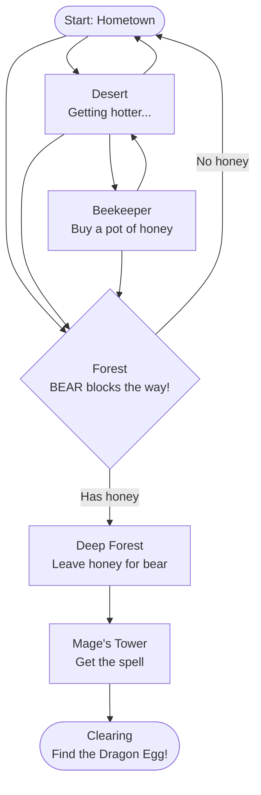

# Dragon-Egg-Game

```mermaid
flowchart TD
    A([Start: Hometown]) --> B[Desert\nGetting hotter...]
    A --> C{Forest\nBEAR blocks the way!}
    B --> C
    B --> D[Beekeeper\nBuy a pot of honey]
    B --> A
    D --> B
    D --> C
    C -->|Has honey| E[Deep Forest\nLeave honey for bear]
    C -->|No honey| A
    E --> F[Mage's Tower\nGet the spell]
    F --> G([Clearing\nFind the Dragon Egg!])
```
